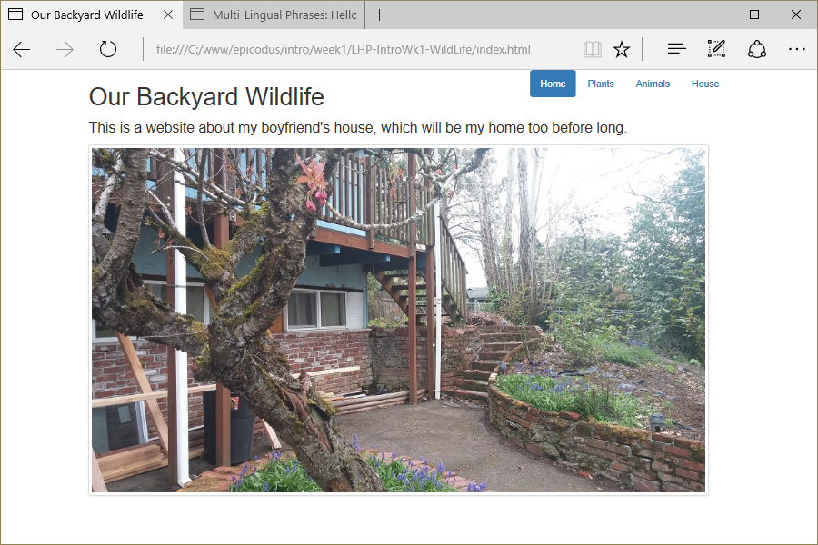

# Pet Website (Backyard Wildlife)
Version 0.0.2: March 28, 2016
by [Karen Freeman-Smith](https://karenfreemansmith.github.io) and [Christopher Carter](http://chriscarter777.github.io)

### Technologies Used
HTML, CSS, Bootstrap, Git, Github

## Description
[Learn How to Program](http://learnhowtoprogram.com) Intro to Programming Week 1 Pair Project with Christopher Carter: Build a pet website to learn fundamentals of HTML and CSS. * Version 0.0.2 - Work with contributor to learn about teamwork on Github.

## Setup/Installation
* [View on Github Pages](https://karenfreemansmith.github.io/LHP-IntroWk1-WildLife)

 __OR__
* Clone project to your computer
* Open index.html in your favorite browser

## Support & Contact
For questions, concerns, or suggestions please email karenfreemansmith@gmail.com

## Known Issues
* None

## Legal
* Licensed under the GNU General Public License v3.0

Copyright (c) 2016 Copyright _[Karen Freeman-Smith](https://karenfreemansmith.github.io) & [Christopher Carter](http://chriscarter777.github.io)_ All Rights Reserved.
